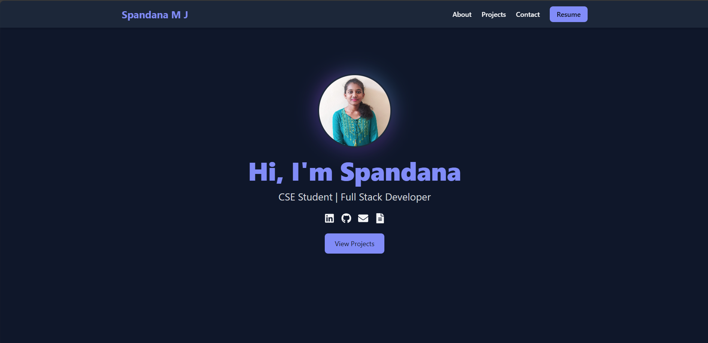
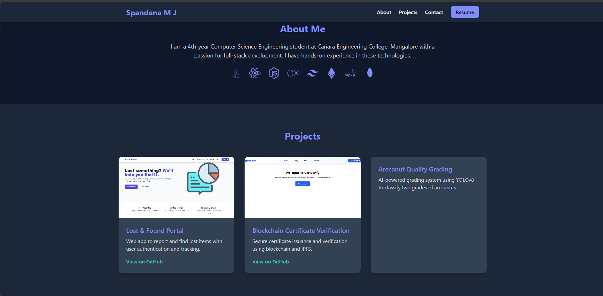

# 👋 Hi, I'm Spandana Mj

👋 Hi, I’m Spandana, a software engineer building **full-stack applications, Blockchain DApps**.  
I’m passionate about solving real-world problems and actively looking for opportunities to create impact through technology.

---

## 🖥️ About Me

🎓 Software engineer & web developer focused on creating **user-friendly applications**.  
💡 Enjoy working on **MERN stack, Blockchain, and AI projects**.  
🌱 Always learning new technologies and improving my skills.  
⚡ Fun fact: I love turning ideas into real-world solutions!

---

## 🚀 Tech Stack

**Frontend:**  
  
  
  
  
   

**Backend:**  
  
  

**Database:**  
  

**Blockchain:**  
  
  

**Tools:**  
  
  
  

---

## 🌟 Featured Projects

| Project | Description | Tech Used | Demo |
|---------|-------------|-----------|------|
| [Lost & Found System](https://github.com/Spandana-MJ/lost-found) | MERN app for reporting and verifying lost & found items. **User auth, admin dashboard, real-time updates**. | React, Node, MongoDB |[video-link](https://drive.google.com/file/d/1nqynk7T3omzTwLk5Q1odDyn_D3urLc1Y/view?usp=sharing)|
| [Certificate Verification on Blockchain](https://github.com/Spandana-MJ/CertVerify) | Verifies academic certificates using smart contracts on Ethereum. **Secure, decentralized verification**. | Solidity, Hardhat, React |[video-link](https://drive.google.com/file/d/1nqynk7T3omzTwLk5Q1odDyn_D3urLc1Y/view?usp=sharing)|
| [Arecanut Quality Detection](#) | AI project to detect quality of arecanuts using YOLOv8. **~98% accuracy**, detects 4–5 nuts per image. | Python, Deep Learning

---

## 📊 Skills

**Frontend:**  
React ⚡⚡⚡⚡⚡ | Tailwind ⚡⚡⚡⚡ | JavaScript ⚡⚡⚡⚡  

**Backend:**  
Node.js ⚡⚡⚡⚡ | Express ⚡⚡⚡⚡ | MongoDB ⚡⚡⚡⚡  

**Blockchain & AI:**  
Solidity ⚡⚡⚡⚡ | YOLOv8 ⚡⚡⚡⚡ | Python ⚡⚡⚡⚡  

---

## 🧾 Portfolio Screenshots

  

---

## 📈 GitHub Stats

  

---

## 📫 Connect With Me

🌐 **Portfolio Website:** [portfolio-link.com](https://my-portfolio-alpha-one-48.vercel.app)  
💼 **LinkedIn:** [linkedin.com/in/spandana-mj](https://linkedin.com/in/Spandana-MJ)  
📧 **Email:** spandanaspandumj@gmail.com  
🐙 **GitHub:** [github.com/Spandana-MJ](https://github.com/Spandana-MJ)

---

⭐ *If you like my work, consider giving this repo a star!*  
